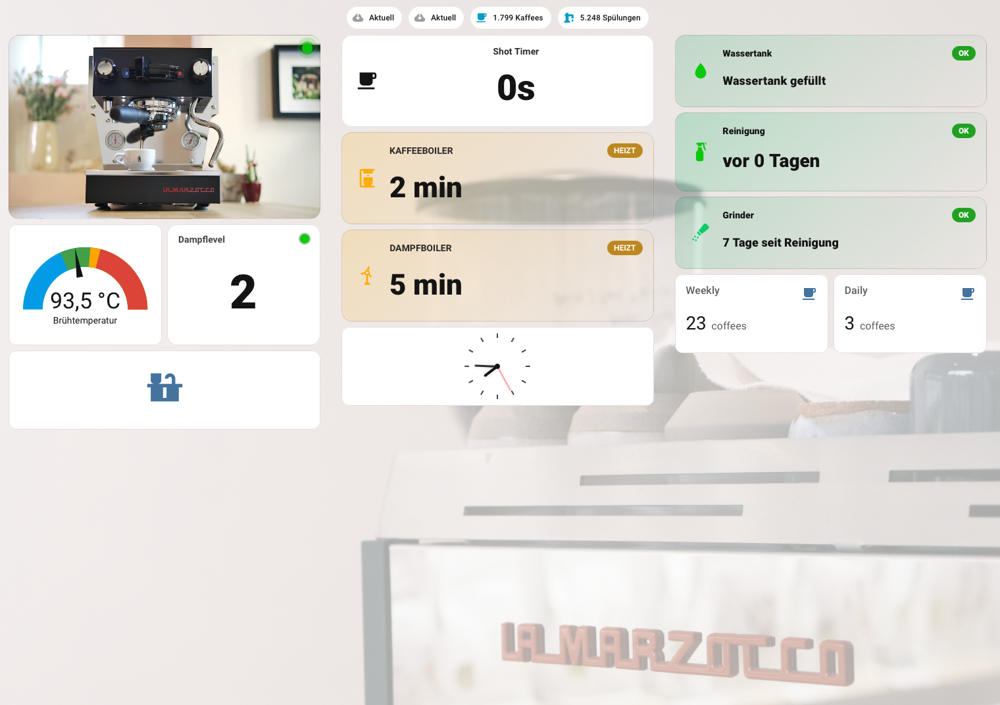

# La Marzocco Home Assistant Dashboard

A feature-rich Home Assistant dashboard for La Marzocco espresso machines (Linea Micra, Linea Mini and others).



## Features

- **Power toggle** with animated status indicator
- **Brew temperature** gauge
- **Steam level** display and boiler toggle
- **Shot timer** – counts seconds live during extraction
- **Coffee & steam boiler** warm-up countdown
- **Water tank** status with alert
- **Machine cleaning** status (color-coded by days since last clean)
- **Grinder cleaning** tracker (tap to reset)
- **Daily & weekly shot** statistics

## Prerequisites

### Required Integrations
- [La Marzocco Integration](https://www.home-assistant.io/integrations/lamarzocco/) installed and configured

### Required HACS Frontend Cards
Install via [HACS](https://hacs.xyz):
- [button-card](https://github.com/custom-cards/button-card)
- [clock](https://github.com/zompa/ha-clock) *(optional – only for the analog clock card)*

## Installation

### Step 1 – Find your machine's entity prefix

1. Go to **Settings → Devices & Services → La Marzocco**
2. Click on your machine
3. Note the entity IDs – they all share a common prefix, e.g. `linea_micra` or `gs3`

### Step 2 – Create required Helpers

Go to **Settings → Devices & Services → Helpers → Create Helper**:

| Helper type | Name | Entity ID |
|---|---|---|
| Date/Time | Grinder Last Cleaning | `input_datetime.grinder_last_cleaning` |

### Step 3 – Add the Shot Timer sensor

Add the contents of `configuration.yaml` to your HA `configuration.yaml`.

Replace `YOUR_MACHINE` with your machine's entity prefix (e.g. `linea_micra`).

**Example for a Linea Micra:**
```yaml
template:
  - trigger:
      - platform: time_pattern
        seconds: "/1"
    sensor:
      - name: Linea Micra Shot Timer
        unique_id: linea_micra_shot_timer
        state: >
          
          ...
```

After editing, restart Home Assistant.

### Step 4 – Add the Dashboard

1. Go to **Settings → Dashboards → Add Dashboard**
2. Give it a name (e.g. `La Marzocco`)
3. Open the new dashboard → three-dot menu → **Edit** → **Raw configuration editor**
4. Paste the contents of `dashboard.yaml`
5. Replace all occurrences of `YOUR_MACHINE` with your machine's entity prefix

**Quick way to replace:** use your editor's find & replace:
- Find: `YOUR_MACHINE`
- Replace with: `linea_micra` *(or your prefix)*

### Step 5 – Optional: Background Image

The dashboard supports a background image. Either:
- Upload an image via **Media → Upload** and set the path in the dashboard config
- Or remove the `background:` block entirely for a plain background

## Entity Reference

All entities in this dashboard follow the pattern `domain.YOUR_MACHINE_entity_name`.

| Entity | Description |
|---|---|
| `switch.YOUR_MACHINE` | Machine power |
| `number.YOUR_MACHINE_soll_temperatur_fur_kaffee` | Brew temperature target |
| `switch.YOUR_MACHINE_dampfkessel` | Steam boiler on/off |
| `select.YOUR_MACHINE_dampf_stufe` | Steam level (1–3) |
| `sensor.YOUR_MACHINE_bereitschaftszeit_des_kaffeekessels` | Coffee boiler ready time |
| `sensor.YOUR_MACHINE_bereitschaftszeit_des_dampfkessels` | Steam boiler ready time |
| `binary_sensor.YOUR_MACHINE_wassertank_leer` | Water tank empty |
| `sensor.YOUR_MACHINE_letzte_reinigungszeit` | Last machine cleaning time |
| `sensor.YOUR_MACHINE_gesamtzahl_zubereiteter_kaffees` | Total shots pulled |
| `sensor.YOUR_MACHINE_gesamtzahl_durchgefuhrter_spulungen` | Total flushes |
| `sensor.YOUR_MACHINE_startzeit_des_bruhvorgangs` | Brew start time *(used by shot timer)* |
| `update.YOUR_MACHINE_gateway_firmware` | Gateway firmware update |
| `sensor.YOUR_MACHINE_shot_timer` | Shot timer *(custom, from configuration.yaml)* |
| `input_datetime.grinder_last_cleaning` | Grinder cleaning tracker *(helper, manually created)* |

## Compatibility

Tested with:
- La Marzocco Linea Micra

Should work with (same integration entities):
- La Marzocco Linea Mini
- Other La Marzocco machines supported by the integration

> **Note:** Entity names may be in German if your HA language is set to German. If your entity IDs differ, check the entity names in Settings → Devices.

## Contributing

Pull requests and issues welcome. If you use a different La Marzocco machine and need to adjust entity names, please open an issue or PR.
